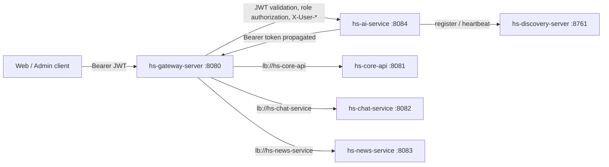

# Architecture and integration contract

## Runtime topology



The new AI route must remain before the Gateway's `/api/v1/**` Core catch-all route. Gateway rewrites `/api/v1/ai/{path}` to `/{path}`, verifies the incoming JWT, removes caller-provided identity headers, and sets `X-User-Id`, `X-User-Email`, `X-User-Name`, `X-User-Name-B64`, `X-User-Role`, and `X-User-Authorities` from the verified token and resolved access. Only `GET /api/v1/ai/ping` is configured as public; other API and documentation routes follow Gateway's authenticated default.

The service registers `HS-AI-SERVICE` in Eureka, heartbeats every 30 seconds, and deregisters during a graceful shutdown. The advertised host defaults to automatic outbound IPv4 detection; override `EUREKA_INSTANCE_HOSTNAME` for Docker/VM or multiple-adapter setups.

## Request identity and trust

Protected API handlers use `get_current_user`, which requires `X-User-Id` and maps the Gateway identity into `UserContext`. `X-User-Authorities` is parsed as a comma-separated list. `X-User-Name-B64` is decoded as UTF-8 before falling back to `X-User-Name`.

Successful business responses use the NestJS envelope `{ "code": 1000, "result": ... }`. The Eureka ping endpoint returns the plain string `"pong"`, matching Chat and News.

The identity headers are trustworthy only when the request entered through Gateway. Do not expose port 8084 to public clients; in deployed environments limit network access to Gateway and health monitoring. Never accept identity or authorities from JSON request bodies.

## Downstream API calls

`GatewayApiClient` is the single HTTP integration point for Core, Chat, and News. It requires an inbound Bearer token, sends that token to Gateway, and limits paths to non-AI `/api/v1/...` endpoints to prevent recursive calls. Gateway performs authorization and produces fresh identity headers for the downstream service.

```python
response = await request.app.state.gateway_client.request(
    "GET",
    "/api/v1/listings/me",
    request=request,
)
response.raise_for_status()
```

The client is intended to be wrapped by named application clients (for example `CoreApiClient`) as API use cases are implemented. This keeps HTTP transport and token propagation consistent.

## Folder responsibilities

```text
src/homespace_ai/
├── api/v1/                    HTTP routes and request/response schemas
├── application/use_cases/     Use-case orchestration
├── domain/                    AI product rules and domain types
├── clients/                   Gateway and downstream service clients
├── core/                      Settings, logging, security, shared errors
├── discovery/                 Eureka registration and heartbeat
├── knowledge/                 Curated system guides and policy RAG
│   ├── ingestion/              Parsing, chunking, and indexing
│   └── retrieval/              Scoped retrieval and citations
├── tools/                     Read-only business API tools
├── property_search/           Structured search and ranking
├── models/                    Provider, embedding, reranker adapters
├── events/                    Kafka consumers/projections
└── repositories/              AI-owned persistence

tests/
├── unit/                      Domain and use-case checks
├── integration/               Database and external client checks
└── contract/                  Gateway identity/API contract checks
```

Keep HTTP code in `api`, use-case orchestration in application modules, business rules in domain modules, and external communication behind `clients`, `repositories`, or `discovery`. Dynamic user and transaction data remains authoritative in Core/Chat/News APIs; RAG is for curated system knowledge.

## Configuration

`.env.example` lists local settings. `.env` is local-only and ignored by Git. Java services and Nest services use the same Eureka URL and service naming convention. Gateway owns JWT validation and must not be bypassed by web clients.
